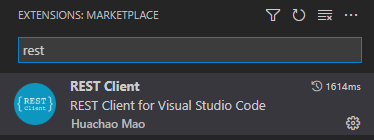

# b2c-app-registration-admin-consent

# Introduction

This repository provides a code sample how to create an Azure B2C (or AAD) app registration with API (scope) permission and admin consent using Microsoft Graph SDK.


##	Intended Audience 
The intended audiences are [Microsoft Identity Platform](https://learn.microsoft.com/en-us/azure/active-directory/develop/) and [Azure Active Directory B2C](https://learn.microsoft.com/en-us/azure/active-directory-b2c/)developers who have familiarity with [Microsoft Graph SDK](https://learn.microsoft.com/en-us/graph/overview?view=graph-rest-1.0).  

While the code samples are provided in both Microsoft Graph REST API and Graph SDK for .NET, the Graph REST API concepts apply to every Microsoft Graph SDK platform, including Node.JS and Python.

This `README.md` file references Azure AD B2C; the concept, code, and approach also apply to Azure Active Directory. Although the scenario explained here is relevant and commonly implemented on Azure AD B2C.   


## Scenario

Microsoft Azure B2C portal is the most common way to create an Application Registration. There are many [walkthrough tutorials](https://learn.microsoft.com/en-us/azure/active-directory-b2c/tutorial-register-applications?tabs=app-reg-ga) showing how to create an application using the Azure AD B2C portal user interface.


This code sample repository shows how to create an app registration using [Microsoft Graph SDK](https://learn.microsoft.com/en-us/graph/sdks/sdks-overview). The idea is to automatically create an App Registration in a Line of Business application without exposing the Azure B2C portal to the consuming developers. 

While a [single Graph call](https://learn.microsoft.com/en-us/graph/api/application-post-applications?view=graph-rest-1.0&tabs=http
) can create a new application, the new application lacks the following requirements:
- Scope API permissions need to be added to the application (#1 in the screenshot below)
- Admin consent must be added to the Scope permissions (#2 in the screenshot below)
- The Client secrets are required for OAuth flows 


The application registrations created by this code sample include the above features. 


### OAuth Flows

Azure Active Directory B2C supports many common types of Application Types as explained here:

[Application types that can be used in Active Directory B2C](https://learn.microsoft.com/en-us/azure/active-directory-b2c/application-types)

While the general approach in this code sample can apply to every type of B2C application registration, the code sample creates an App Registration that supports [Client Credential Flow](https://learn.microsoft.com/en-us/azure/active-directory-b2c/client-credentials-grant-flow).

The sample code creates `App1` in the diagram below using Microsoft Graph SDK:


# Prerequisites


### 1- The API publishing app

The code assumes that `App 2` In the diagram above is already created, because commonly, the consuming `App 1` is created by a line of business application and handed to developers so that they can all services in `App 2`   

### 2- Microsoft Graph application for making Graph calls
To run this code sample, you need to register a [Microsoft Graph application](https://learn.microsoft.com/en-us/azure/active-directory-b2c/microsoft-graph-get-started?tabs=app-reg-ga)

### 3- Microsoft Graph application permissions

While the `Application.ReadWrite.All` Graph API permission (shown below) allows to create `Application`, `ServicePrincipal` and `PasswordCredential` Graph resources, **it cannot create** the `Oauth2PermissionGrants` resource. The resource types are explained in the "Concepts" section. 


Instead of `Application.ReadWrite.All`, the `Application administrator`  role needs to be assigned to the Microsoft Graph Application as shown below:


# Concepts

It is essential to comprehend the following diagram to be able to understand the sample code. The ERD style diagram shows the relationship between the Microsoft Graph resource types involved in the application registration process:


The code sample creates the resourcesestablishes relationships as shown above.

### Service Principal Object

To access resources that are secured by an Azure AD tenant, the entity that requires access must be represented by a security principal.

There are three types of service principal. For this scenario, we work with #1:

1. **Application**: The type of service principal is the local representation, or application instance, of a global application object in a single tenant or directory.
2. **Managed identity**
3. **Legacy**


For more information, refer to the following page:
[Application and service principal objects in Azure Active Directory](https://learn.microsoft.com/en-us/azure/active-directory/develop/app-objects-and-service-principals)

# Code included in the repository

This repository includes two samples in the following directories :

- `HttpCalls`
- `B2CAutomatedAppRegistration`

## `HttpCalls`
Includes the raw Graph REST API calls. 
The `app-creation.http` file includes raw Microsoft Graph REST call samples that create the Graph resources explained in the section "Concepts" above. 

You need  Visual Studio Code Extension [REST Client](https://marketplace.visualstudio.com/items?itemName=humao.rest-client) to make the REST calls in the `app-creation.http` file. 

Similar to the Postman tool, the `REST Client` extension helps with HTTP calls, and it is much simpler and well-integrated in Visual Studio Code workflows:



The `app-creation.http` needs a `.env` file created in the same folder. The `.env` is added to `.gitignore` to prevent secret(s) be committed to the git repository.

Sample `.env`:

```
client_secret = <<ADD GRAPH APPLICATION CLIENT SECRET HERE>>
```

## `B2CAutomatedAppRegistration`

This is a C# code sample that creates the that create the Graph resources explained in the section "Concepts" above. 


Explain the App template can be extracted from an existing app created through portal


# Next steps - ideas for enhancements
    
- Polish the code, add descriptive comments and break the C# method `CreateSampleApp` into smaller functional pieces
- Add additional Application types to the sample that support a variety of OAuth flows
- Provide code sample for additional platforms:
    - `Node.js` has native support for JSON, and it is one of the easier platforms for creating Microsoft Graph applications
    - `Python`

